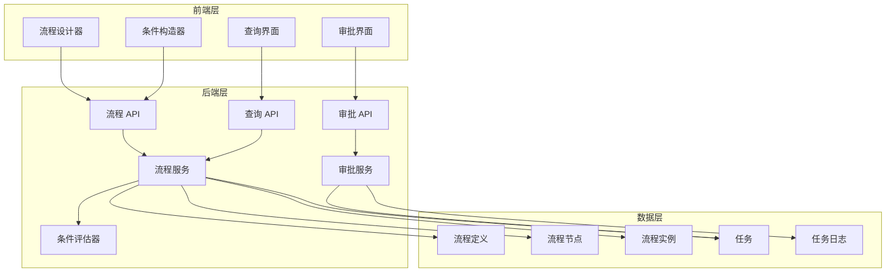
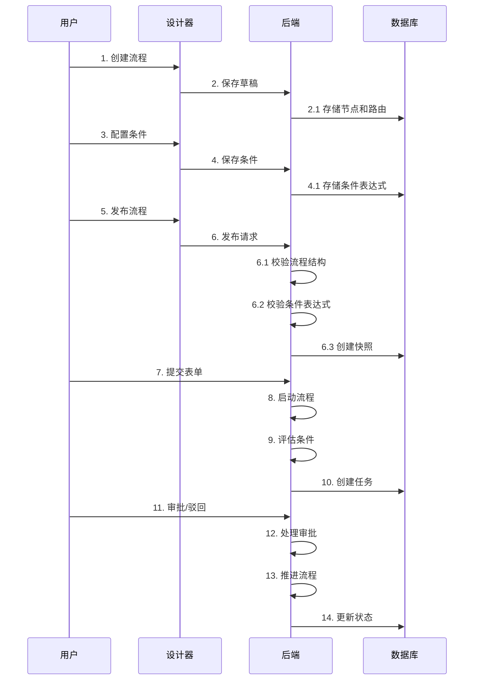

# 审批流程优化 - 设计文档

## 一、系统架构

### 1.1 整体架构图



### 1.2 核心流程



---

## 二、数据模型

### 2.1 核心表结构

#### FlowNode（流程节点）

```python
class FlowNode(DBBaseModel):
    id: int                          # 主键
    flow_definition_id: int          # 流程定义 ID
    name: str                        # 节点名称
    type: str                        # 节点类型：start/approval/condition/cc/end
    
    # 审批人配置（APPROVAL 节点）
    assignee_type: str               # 审批人类型：user/group/role/department/position/expr
    assignee_value: str              # 审批人值
    
    # 驳回策略（APPROVAL 节点）
    reject_strategy: str = 'TO_START'  # TO_START/TO_PREVIOUS
    
    # 条件分支配置（CONDITION 节点）
    condition_branches: dict = None  # 条件分支配置
    # 格式：{
    #   "branches": [
    #     {
    #       "priority": 1,
    #       "label": "大额招待费",
    #       "condition": { "type": "GROUP", ... },
    #       "target_node_id": 123
    #     }
    #   ],
    #   "default_target_node_id": 456
    # }
    
    # 其他配置
    sla_hours: int = None            # SLA 时长（小时）
    auto_approve_enabled: bool = False  # 是否启用自动审批
    
    position_x: float = 0            # 画布 X 坐标
    position_y: float = 0            # 画布 Y 坐标
```

#### FlowRoute（流程路由）

```python
class FlowRoute(DBBaseModel):
    id: 