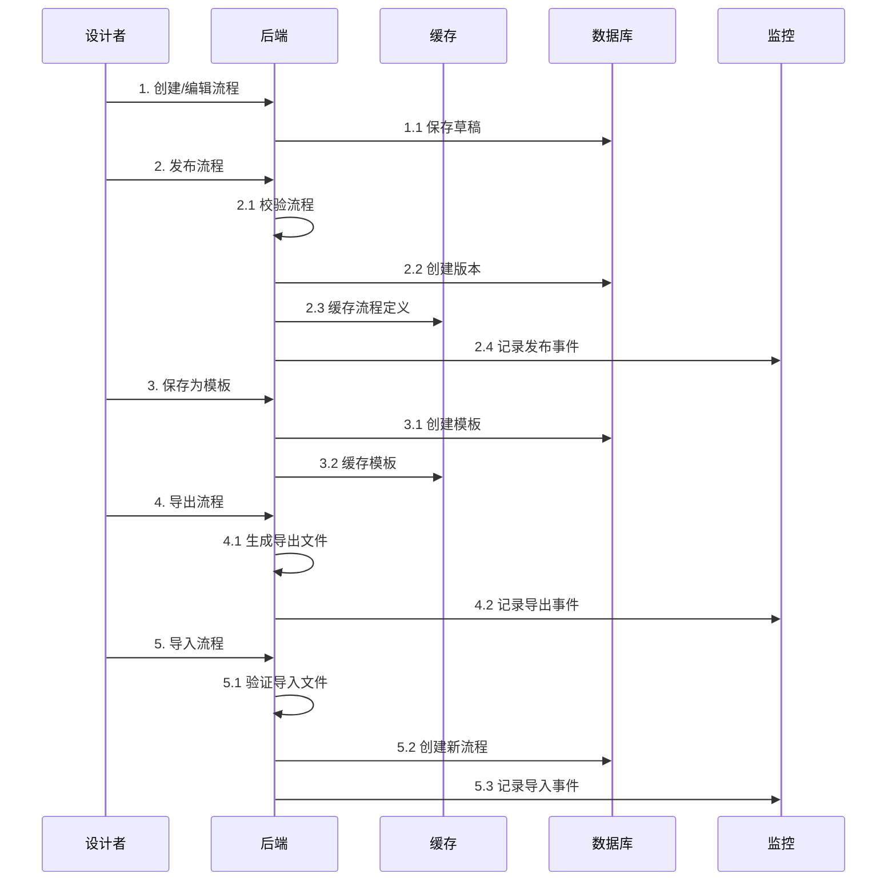

# 审批流程系统 - 第四周及剩余任务设计文档

## 📋 文档概览

本文档涵盖 FormFlow 审批流程系统的第四周及剩余任务（第 4-6 周及之后），包括：
- 第四周：流程设计器完善与高级功能
- 第五周：性能优化与监控完善
- 第六周及之后：系统集成与扩展

**项目背景**：前三周已完成核心功能（CONDITION 节点、CC 节点、审批操作 API、表单字段 API、查询接口、流程设计器 UI 基础组件）。

---

## 一、系统架构概览

### 1.1 整体架构

```mermaid
graph TB
    subgraph Frontend["前端层"]
        Designer["流程设计器"]
        ApprovalUI["审批界面"]
        QueryUI["查询界面"]
        Dashboard["仪表板"]
    end
    
    subgraph Backend["后端层"]
        FlowAPI["流程 API"]
        ApprovalAPI["审批 API"]
        QueryAPI["查询 API"]
        VersionAPI["版本管理 API"]
        TemplateAPI["模板库 API"]
        ExportAPI["导入导出 API"]
    end
    
    subgraph Services["服务层"]
        ProcessService["流程服务"]
        ConditionEvaluator["条件评估器"]
        ApprovalService["审批服务"]
        VersionService["版本管理服务"]
        TemplateService["模板库服务"]
        ExportService["导入导出服务"]
        CacheService["缓存服务"]
        MonitorService["监控服务"]
    end
    
    subgraph Database["数据层"]
        FlowDef["流程定义"]
        FlowVersion["流程版本"]
        FlowTemplate["流程模板"]
        ProcessInst["流程实例"]
        Task["任务"]
        OperationLog["操作日志"]
        PerformanceMetrics["性能指标"]
    end
    
    Frontend --> Backend
    Backend --> Services
    Services --> Database
```



### 1.2 核心流程（完整生命周期）



---

## 二、第四周：流程设计器完善与高级功能

### 2.1 流程设计器 UI 完善

#### 2.1.1 画布增强功能

**需求**：
- 支持多选节点
- 支持批量删除
- 支持撤销/重做
- 支持快捷键操作
- 支持网格对齐
- 支持自动布局

**实现方案**：

```typescript
// 前端：my-app/src/components/flow-designer/FlowCanvas.vue 增强

interface CanvasState {
  selectedNodes: Set<string>
  history: CanvasSnapshot[]
  historyIndex: number
  gridSize: number
  autoLayout: boolean
}

interface CanvasSnapshot {
  nodes: FlowNode[]
  routes: FlowRoute[]
  timestamp: number
}

// 快捷键映射
const SHORTCUTS = {
  'ctrl+z': 'undo',
  'ctrl+y': 'redo',
  'ctrl+a': 'selectAll',
  'delete': 'deleteSelected',
  'ctrl+c': 'copy',
  'ctrl+v': 'paste',
  'ctrl+d': 'duplicate',
}
```

**前端组件**：
- `FlowCanvas.vue`：增强多选、撤销/重做、快捷键
- `SelectionBox.vue`：多选框组件
- `HistoryPanel.vue`：历史记录面板

**工作量**：3-4 天

---

#### 2.1.2 节点编辑器完善

**需求**：
- 支持节点模板
- 支持节点复制
- 支持批量编辑
- 支持节点搜索
- 支持节点预览

**实现方案**：

```typescript
// 前端：my-app/src/components/flow-designer/FlowNodeEditor.vue 增强

interface NodeTemplate {
  id: string
  name: string
  type: FlowNodeType
  config: Partial<FlowNode>
  description: string
}

interface BatchEditConfig {
  selectedNodeIds: string[]
  updates: Partial<FlowNode>
}

// 节点模板库
const NODE_TEMPLATES: Record<string, NodeTemplate> = {
  'approval-manager': {
    type: 'APPROVAL',
    config: { assignee_type: 'role', assignee_value: 'manager' }
  },
  'approval-department': {
    type: 'APPROVAL',
    config: { assignee_type: 'department', assignee_value: '' }
  },
  'condition-amount': {
    type: 'CONDITION',
    config: { condition_branches: [] }
  }
}
```

**前端组件**：
- `NodeTemplateLibrary.vue`：节点模板库
- `BatchNodeEditor.vue`：批量编辑器
- `NodePreview.vue`：节点预览

**工作量**：2-3 天

---

#### 2.1.3 路由编辑器完善

**需求**：
- 支持路由优先级可视化
- 支持路由条件预览
- 支持路由测试
- 支持路由模板

**实现方案**：

```typescript
// 前端：my-app/src/components/flow-designer/FlowRouteEditor.vue 增强

interface RouteTestData {
  formData: Record<string, any>
  expectedRoute: string
}

interface RouteTemplate {
  id: string
  name: string
  condition: ConditionGroup
  description: string
}

// 路由测试
async function testRoute(route: FlowRoute, testData: RouteTestData): Promise<boolean> {
  const evaluator = new ConditionEvaluator()
  return evaluator.evaluate(route.condition_json, testData.formData)
}
```

**前端组件**：
- `RoutePriorityVisualizer.vue`：优先级可视化
- `RouteTestPanel.vue`：路由测试面板
- `RouteTemplateLibrary.vue`：路由模板库

**工作量**：2-3 天

---

### 2.2 版本管理系统

#### 2.2.1 数据模型

```python
# 后端：backend/app/models/workflow.py 扩展

class FlowVersion(DBBaseModel):
    """流程版本"""
    id: int
    flow_definition_id: int
    version_number: int  # 版本号：1, 2, 3...
    version_name: str    # 版本名称：v1.0, v1.1...
    description: str     # 版本描述
    
    # 版本内容快照
    nodes_snapshot: dict  # 节点配置快照
    routes_snapshot: dict # 路由配置快照
    
    # 版本状态
    status: str  # DRAFT/PUBLISHED/ARCHIVED
    is_current: bool = False  # 是否为当前版本
    
    # 版本信息
    created_by: int
    created_at: datetime
    published_at: datetime = None
    archived_at: datetime = None
    
    # 版本对比
    parent_version_id: int = None  # 父版本 ID
    change_summary: str = None     # 变更摘要
    
    # 版本回滚
    can_rollback: bool = True
    rollback_reason: str = None
```

**工作量**：1 天

---

#### 2.2.2 版本管理 API

```python
# 后端：backend/app/api/v1/flows.py 扩展

@router.get("/flows/{flow_id}/versions")
async def list_flow_versions(
    flow_id: int,
    skip: int = 0,
    limit: int = 10,
    db: Session = Depends(get_db)
) -> List[FlowVersionResponse]:
    """获取流程版本列表"""
    pass

@router.get("/flows/{flow_id}/versions/{version_id}")
async def get_flow_version(
    flow_id: int,
    version_id: int,
    db: Session = Depends(get_db)
) -> FlowVersionResponse:
    """获取指定版本的流程定义"""
    pass

@router.post("/flows/{flow_id}/versions/{version_id}/compare")
async def compare_versions(
    flow_id: int,
    version_id: int,
    compare_with_version_id: int,
    db: Session = Depends(get_db)
) -> VersionComparisonResponse:
    """对比两个版本的差异"""
    pass

@router.post("/flows/{flow_id}/versions/{version_id}/rollback")
async def rollback_to_version(
    flow_id: int,
    version_id: int,
    db: Session = Depends(get_db)
) -> FlowDefinitionResponse:
    """回滚到指定版本"""
    pass

@router.post("/flows/{flow_id}/versions/{version_id}/archive")
async def archive_version(
    flow_id: int,
    version_id: int,
    db: Session = Depends(get_db)
) -> FlowVersionResponse:
    """归档版本"""
    pass
```

**工作量**：2-3 天

---

#### 2.2.3 版本管理服务

```python
# 后端：backend/app/services/flow_version_service.py

class FlowVersionService:
    """流程版本管理服务"""
    
    async def create_version(
        self,
        flow_id: int,
        version_name: str,
        description: str,
        db: Session
    ) -> FlowVersion:
        """创建新版本"""
        # 1. 获取当前流程定义
        # 2. 创建版本快照
        # 3. 保存版本记录
        # 4. 更新当前版本标记
        pass
    
    async def publish_version(
        self,
        flow_id: int,
        version_id: int,
        db: Session
    ) -> FlowVersion:
        """发布版本"""
        # 1. 校验版本
        # 2. 更新版本状态为 PUBLISHED
        # 3. 更新当前版本
        # 4. 清除缓存
        pass
    
    async def compare_versions(
        self,
        version_id_1: int,
        version_id_2: int,
        db: Session
    ) -> VersionComparison:
        """对比两个版本"""
        # 1. 获取两个版本的快照
        # 2. 对比节点差异
        # 3. 对比路由差异
        # 4. 生成对比报告
        pass
    
    async def rollback_to_version(
        self,
        flow_id: int,
        version_id: int,
        db: Session
    ) -> FlowDefinition:
        """回滚到指定版本"""
        # 1. 校验版本
        # 2. 创建新版本（基于目标版本）
        # 3. 更新当前版本
        # 4. 清除缓存
        pass
```

**工作量**：2-3 天

---

### 2.3 模板库系统

#### 2.3.1 数据模型

```python
# 后端：backend/app/models/workflow.py 扩展

class FlowTemplate(DBBaseModel):
    """流程模板"""
    id: int
    tenant_id: int
    name: str
    description: str
    category: str  # 招待费、出差、采购等
    
    # 模板内容
    nodes_snapshot: dict
    routes_snapshot: dict
    
    # 模板信息
    is_public: bool = False  # 是否公开
    is_official: bool = False  # 是否官方模板
    
    # 使用统计
    usage_count: int = 0
    last_used_at: datetime = None
    
    # 元数据
    tags: List[str] = []
    preview_image: str = None
    
    created_by: int
    created_at: datetime
    updated_at: datetime
```

**工作量**：1 天

---

#### 2.3.2 模板库 API

```python
# 后端：backend/app/api/v1/templates.py

@router.get("/templates")
async def list_templates(
    category: str = None,
    is_public: bool = None,
    skip: int = 0,
    limit: int = 10,
    db: Session = Depends(get_db)
) -> List[FlowTemplateResponse]:
    """获取模板列表"""
    pass

@router.post("/templates")
async def create_template(
    request: CreateTemplateRequest,
    db: Session = Depends(get_db)
) -> FlowTemplateResponse:
    """创建模板"""
    pass

@router.post("/templates/{template_id}/use")
async def use_template(
    template_id: int,
    request: UseTemplateRequest,
    db: Session = Depends(get_db)
) -> FlowDefinitionResponse:
    """使用模板创建流程"""
    pass

@router.post("/templates/{template_id}/share")
async def share_template(
    template_id: int,
    request: ShareTemplateRequest,
    db: Session = Depends(get_db)
) -> FlowTemplateResponse:
    """分享模板"""
    pass

@router.get("/templates/categories")
async def get_template_categories(
    db: Session = Depends(get_db)
) -> List[str]:
    """获取模板分类列表"""
    pass
```

**工作量**：2-3 天

---

#### 2.3.3 模板库服务

```python
# 后端：backend/app/services/template_service.py

class TemplateService:
    """流程模板服务"""
    
    async def create_template_from_flow(
        self,
        flow_id: int,
        template_name: str,
        category: str,
        db: Session
    ) -> FlowTemplate:
        """从流程创建模板"""
        pass
    
    async def use_template(
        self,
        template_id: int,
        flow_name: str,
        db: Session
    ) -> FlowDefinition:
        """使用模板创建流程"""
        pass
    
    async def get_recommended_templates(
        self,
        category: str,
        limit: int = 5,
        db: Session = None
    ) -> List[FlowTemplate]:
        """获取推荐模板"""
        pass
```

**工作量**：2-3 天

---

### 2.4 导入导出系统

#### 2.4.1 导出功能

```python
# 后端：backend/app/api/v1/flows.py 扩展

@router.get("/flows/{flow_id}/export")
async def export_flow(
    flow_id: int,
    format: str = "json",  # json, yaml, xml
    include_data: bool = False,  # 是否包含实例数据
    db: Session = Depends(get_db)
) -> FileResponse:
    """导出流程定义"""
    pass

@router.post("/flows/export-batch")
async def export_flows_batch(
    request: ExportBatchRequest,
    db: Session = Depends(get_db)
) -> FileResponse:
    """批量导出流程"""
    pass
```

**导出格式**：

```json
{
  "version": "1.0",
  "export_time": "2024-01-15T10:30:00Z",
  "flow": {
    "id": 123,
    "name": "招待费审批",
    "description": "...",
    "nodes": [...],
    "routes": [...],
    "metadata": {...}
  }
}
```

**工作量**：2 天

---

#### 2.4.2 导入功能

```python
# 后端：backend/app/api/v1/flows.py 扩展

@router.post("/flows/import")
async def import_flow(
    file: UploadFile,
    flow_name: str = None,
    overwrite: bool = False,
    db: Session = Depends(get_db)
) -> FlowDefinitionResponse:
    """导入流程定义"""
    pass

@router.post("/flows/import-batch")
async def import_flows_batch(
    files: List[UploadFile],
    db: Session = Depends(get_db)
) -> List[FlowDefinitionResponse]:
    """批量导入流程"""
    pass
```

**导入验证**：
- 文件格式验证
- 流程结构验证
- 节点配置验证
- 路由配置验证
- 冲突检测

**工作量**：2-3 天

---

#### 2.4.3 导入导出服务

```python
# 后端：backend/app/services/export_service.py 扩展

class ExportService:
    """导入导出服务"""
    
    async def export_flow(
        self,
        flow_id: int,
        format: str = "json",
        db: Session = None
    ) -> bytes:
        """导出流程"""
        pass
    
    async def import_flow(
        self,
        file_content: bytes,
        file_format: str,
        flow_name: str = None,
        db: Session = None
    ) -> FlowDefinition:
        """导入流程"""
        pass
    
    async def validate_import_file(
        self,
        file_content: bytes,
        file_format: str
    ) -> ValidationResult:
        """验证导入文件"""
        pass
```

**工作量**：2-3 天

---

### 2.5 第四周工作量总结

| 功能 | 工作量 | 优先级 |
|------|--------|--------|
| 画布增强 | 3-4d | P0 |
| 节点编辑器完善 | 2-3d | P0 |
| 路由编辑器完善 | 2-3d | P0 |
| 版本管理系统 | 5-7d | P1 |
| 模板库系统 | 5-7d | P1 |
| 导入导出系统 | 6-8d | P1 |
| **第四周总计** | **23-32d** | - |

**建议分配**：
- 第 1-2 天：画布增强 + 节点编辑器完善
- 第 3-4 天：路由编辑器完善
- 第 5 天：版本管理系统（数据模型 + API）
- 第 6-7 天：模板库系统
- 第 8-10 天：导入导出系统

---

