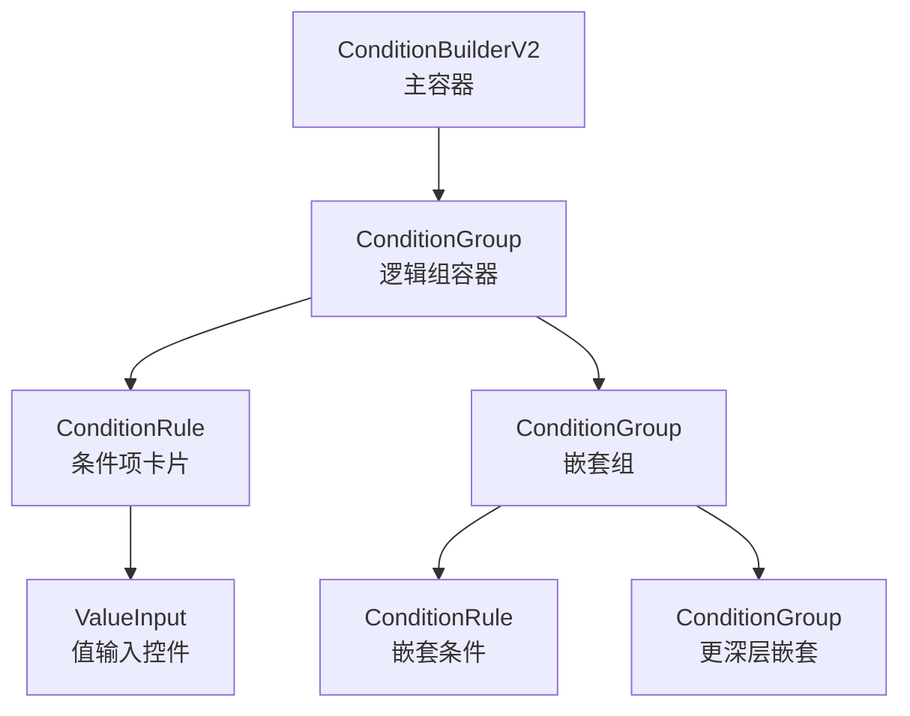

# 设计文档：条件构造器 UI 优化

## 概述

条件构造器是表单审批流程配置的核心组件，用于可视化构建复杂的路由条件规则。当前实现存在布局紧凑、交互不够直观、嵌套层级不清晰等问题。本设计通过改进布局结构、增强视觉层级、优化交互体验，使条件构造器更易用、更美观。

## 架构设计



## 组件和接口

### 1. ConditionBuilderV2（主容器）

**职责**：
- 管理根条件组的状态
- 从表单 Schema 提取字段列表
- 提供 JSON 预览功能
- 处理整体布局和样式

**改进点**：
- 增加顶部说明区域，展示当前条件的简要描述
- 优化内容区域的间距和背景
- 提供更清晰的操作指引

### 2. ConditionGroup（逻辑组容器）

**职责**：
- 管理条件组的逻辑关系（AND/OR）
- 递归渲染子节点（规则或嵌套组）
- 提供添加/删除子节点的操作

**改进点**：
- 根组和嵌套组采用不同的视觉设计
- 根组：简洁的头部，宽敞的内容区域
- 嵌套组：明显的边框和背景，清晰的层级指示
- 支持折叠/展开嵌套组（可选）
- 改进操作按钮的位置和样式

### 3. ConditionRule（条件项卡片）

**职责**：
- 展示单条条件规则
- 提供字段、运算符、值的选择和编辑
- 支持删除操作

**改进点**：
- 采用卡片式设计，增加内边距和外边距
- 字段、运算符、值采用竖排布局（移动端友好）
- 操作按钮（删除）放在卡片右上角
- 增加悬停效果和过渡动画
- 字段名称和运算符标签更清晰

### 4. ValueInput（值输入控件）

**职责**：
- 根据字段类型和运算符提供合适的输入控件
- 支持多种输入类型（文本、数字、日期、选择等）

**改进点**：
- 输入控件的样式更统一
- 区间输入的分隔符更清晰
- 支持更多的输入类型（如人员选择、部门选择）

## 数据模型

### 条件规则（RULE）

```typescript
interface ConditionRule {
  type: 'RULE'
  fieldKey: string        // 字段标识
  fieldType: FieldType    // 字段类型
  operator: Operator      // 运算符
  value: any             // 值
}
```

### 条件组（GROUP）

```typescript
interface ConditionGroup {
  type: 'GROUP'
  logic: LogicType                          // AND 或 OR
  children: (ConditionRule | ConditionGroup)[] // 子节点
}
```

### 字段定义

```typescript
interface FieldDefinition {
  key: string                    // 字段标识
  name: string                   // 字段名称
  type: FieldType               // 字段类型
  options?: Array<{             // 选项（用于下拉选择）
    label: string
    value: string | number
  }>
  isSystem?: boolean            // 是否为系统字段
}
```

## 布局结构

### 整体布局

```
┌─────────────────────────────────────────────────────┐
│ 条件配置                                             │
│ 通过可视化界面配置路由条件                           │
├─────────────────────────────────────────────────────┤
│                                                     │
│  ┌─────────────────────────────────────────────┐   │
│  │ 满足 [AND/OR] 条件                          │   │
│  ├─────────────────────────────────────────────┤   │
│  │                                             │   │
│  │  ┌─────────────────────────────────────┐   │   │
│  │  │ 条件 1                          [×] │   │   │
│  │  │ ┌─────────────────────────────────┐ │   │   │
│  │  │ │ 字段: [选择字段]                │ │   │   │
│  │  │ │ 运算符: [选择运算符]            │ │   │   │
│  │  │ │ 值: [输入值]                    │ │   │   │
│  │  │ └─────────────────────────────────┘ │   │   │
│  │  └─────────────────────────────────────┘   │   │
│  │                                             │   │
│  │  AND                                        │   │
│  │                                             │   │
│  │  ┌─────────────────────────────────────┐   │   │
│  │  │ 条件 2                          [×] │   │   │
│  │  │ ┌─────────────────────────────────┐ │   │   │
│  │  │ │ 字段: [选择字段]                │ │   │   │
│  │  │ │ 运算符: [选择运算符]            │ │   │   │
│  │  │ │ 值: [输入值]                    │ │   │   │
│  │  │ └─────────────────────────────────┘ │   │   │
│  │  └─────────────────────────────────────┘   │   │
│  │                                             │   │
│  │  [+ 添加条件] [+ 添加条件组]               │   │
│  │                                             │   │
│  └─────────────────────────────────────────────┘   │
│                                                     │
│  [显示 JSON 预览]                                   │
│                                                     │
└─────────────────────────────────────────────────────┘
```

### 嵌套组布局

```
┌─────────────────────────────────────────┐
│ 满足 [AND/OR] 条件                      │
├─────────────────────────────────────────┤
│                                         │
│  ┌─────────────────────────────────┐   │
│  │ 条件 1                      [×] │   │
│  │ ┌─────────────────────────────┐ │   │
│  │ │ 字段: [选择字段]            │ │   │
│  │ │ 运算符: [选择运算符]        │ │   │
│  │ │ 值: [输入值]                │ │   │
│  │ └─────────────────────────────┘ │   │
│  └─────────────────────────────────┘   │
│                                         │
│  AND                                    │
│                                         │
│  ┌─────────────────────────────────┐   │
│  │ ◀ 条件组 (嵌套)            [×] │   │
│  │ ┌─────────────────────────────┐ │   │
│  │ │ 满足 [AND/OR] 条件          │ │   │
│  │ │ ┌─────────────────────────┐ │ │   │
│  │ │ │ 条件 2.1            [×] │ │ │   │
│  │ │ │ ┌─────────────────────┐ │ │ │   │
│  │ │ │ │ 字段: [选择字段]    │ │ │ │   │
│  │ │ │ │ 运算符: [选择运算符]│ │ │ │   │
│  │ │ │ │ 值: [输入值]        │ │ │ │   │
│  │ │ │ └─────────────────────┘ │ │ │   │
│  │ │ └─────────────────────────┘ │ │   │
│  │ │                             │ │   │
│  │ │ [+ 添加条件] [+ 添加条件组] │ │   │
│  │ └─────────────────────────────┘ │   │
│  └─────────────────────────────────┘   │
│                                         │
│  [+ 添加条件] [+ 添加条件组]           │
│                                         │
└─────────────────────────────────────────┘
```

## 条件项卡片设计

### 卡片结构

```
┌─────────────────────────────────────────────────┐
│ 条件 1                                      [×] │
├─────────────────────────────────────────────────┤
│                                                 │
│ 字段                                            │
│ [选择字段 ▼]                                    │
│                                                 │
│ 运算符                                          │
│ [选择运算符 ▼]                                  │
│                                                 │
│ 值                                              │
│ [输入值]                                        │
│                                                 │
└─────────────────────────────────────────────────┘
```

### 卡片样式

- **背景色**：白色 (#ffffff)
- **边框**：1px solid #e0e5ec
- **圆角**：8px
- **内边距**：16px
- **外边距**：8px（与其他卡片之间）
- **悬停效果**：
  - 背景色变为 #f9fbfc
  - 边框色变为 #d3e8e0
  - 阴影：0 2px 8px rgba(0, 0, 0, 0.08)
- **过渡**：all 0.2s ease-out

### 卡片内容

- **标题**：字体大小 14px，字重 600，颜色 #1f2937
- **删除按钮**：
  - 位置：卡片右上角
  - 样式：圆形按钮，红色，大小 small
  - 图标：× 或 trash icon
  - 悬停效果：背景色变为 #fef2f2

### 字段、运算符、值的布局

采用竖排布局（移动端友好）：

```
┌─────────────────────────────────────────────────┐
│ 条件 1                                      [×] │
├─────────────────────────────────────────────────┤
│                                                 │
│ 字段                                            │
│ [选择字段 ▼]                                    │
│                                                 │
│ 运算符                                          │
│ [选择运算符 ▼]                                  │
│                                                 │
│ 值                                              │
│ [输入值]                                        │
│                                                 │
└─────────────────────────────────────────────────┘
```

- **标签**：字体大小 12px，字重 500，颜色 #6b7385，上边距 8px
- **输入框**：宽度 100%，高度 32px，字体大小 13px
- **间距**：标签和输入框之间 4px，各行之间 12px

## 逻辑组的视觉层级

### 根组

- **背景色**：#ffffff
- **边框**：1px solid #e0e5ec
- **圆角**：8px
- **内边距**：16px
- **头部背景**：#f6fbf8
- **头部边框**：1px solid #d3e8e0

### 嵌套组

- **背景色**：#f9fbfc
- **边框**：2px solid #d3e8e0
- **圆角**：8px
- **内边距**：12px
- **头部背景**：#e7f5f0
- **头部边框**：1px solid #d3e8e0
- **嵌套深度指示**：
  - 第一层嵌套：绿色系 (#18a058)
  - 第二层嵌套：蓝色系 (#2080f0)
  - 第三层嵌套：紫色系 (#a060d0)

### 逻辑连接符

- **位置**：条件项之间的中央
- **样式**：字体大小 12px，字重 600，颜色 #18a058
- **上下边距**：4px
- **背景**：可选，浅色背景增加可读性

## 操作按钮设计

### 按钮位置

- **删除按钮**：卡片右上角，圆形，大小 small
- **添加条件按钮**：组底部，虚线样式，左对齐
- **添加条件组按钮**：组底部，虚线样式，左对齐
- **删除组按钮**：嵌套组头部右侧，文字按钮

### 按钮样式

- **添加按钮**：
  - 样式：dashed
  - 类型：primary
  - 大小：small
  - 文本：+ 添加条件 / + 添加条件组
  - 颜色：#2080f0
  - 悬停效果：背景色变为 #e6f2ff

- **删除按钮**：
  - 样式：quaternary（四级）
  - 类型：error
  - 大小：small
  - 圆形：true
  - 颜色：#d03050
  - 悬停效果：背景色变为 #fef2f2

## 响应式设计

### 桌面端（≥1024px）

- 条件项卡片：宽度 100%，内边距 16px
- 字段、运算符、值：竖排布局，每行占 100%
- 操作按钮：水平排列，间距 8px

### 平板端（768px - 1023px）

- 条件项卡片：宽度 100%，内边距 12px
- 字段、运算符、值：竖排布局，每行占 100%
- 操作按钮：水平排列，间距 6px

### 移动端（<768px）

- 条件项卡片：宽度 100%，内边距 12px
- 字段、运算符、值：竖排布局，每行占 100%
- 操作按钮：竖排排列或水平排列（根据空间调整）
- 字体大小：减小 1-2px，提高可读性

## 交互体验改进

### 1. 条件项的添加和删除

- **添加**：点击"+ 添加条件"按钮，在列表末尾添加新条件项
- **删除**：点击条件项右上角的删除按钮，移除该条件项
- **动画**：新增条件项有淡入动画，删除条件项有淡出动画

### 2. 逻辑组的操作

- **添加条件**：在组内添加新的条件规则
- **添加条件组**：在组内添加新的嵌套条件组
- **删除组**：删除整个嵌套条件组及其所有子节点
- **切换逻辑**：在 AND/OR 之间切换

### 3. 嵌套组的展示

- **视觉区分**：嵌套组有明显的边框、背景色和缩进
- **层级指示**：通过颜色和边框宽度区分嵌套深度
- **折叠/展开**（可选）：支持折叠嵌套组以节省空间

### 4. 字段选择

- **字段分组**：表单字段和系统字段分开显示
- **搜索功能**：支持搜索字段名称
- **字段类型图标**：不同字段类型显示不同的图标

### 5. 运算符选择

- **动态更新**：选择字段后，运算符列表自动更新
- **运算符分组**：按类型分组显示运算符（如比较、包含、空值等）

### 6. 值输入

- **智能输入**：根据字段类型和运算符提供合适的输入控件
- **验证反馈**：输入错误时显示错误提示
- **占位符**：提供清晰的占位符文本

## 正确性属性

### 通用属性

```typescript
// 条件树的结构完整性
∀ node ∈ ConditionTree:
  (node.type = 'RULE' ⟹ node.fieldKey ≠ ∅ ∧ node.operator ≠ ∅) ∧
  (node.type = 'GROUP' ⟹ node.logic ∈ {AND, OR} ∧ node.children ≠ ∅)

// 字段类型和运算符的匹配性
∀ rule ∈ ConditionTree:
  rule.type = 'RULE' ⟹ rule.operator ∈ OPERATOR_MAP[rule.fieldType]

// 值的有效性
∀ rule ∈ ConditionTree:
  rule.type = 'RULE' ⟹ 
    (rule.operator ∈ {IS_EMPTY, IS_NOT_EMPTY} ⟹ rule.value = null) ∧
    (rule.operator ∉ {IS_EMPTY, IS_NOT_EMPTY} ⟹ rule.value ≠ null)
```

### UI 相关属性

```typescript
// 嵌套深度限制
∀ group ∈ ConditionTree:
  group.type = 'GROUP' ⟹ depth(group) ≤ MAX_NESTING_DEPTH (e.g., 5)

// 条件项数量限制
∀ group ∈ ConditionTree:
  group.type = 'GROUP' ⟹ |group.children| ≤ MAX_CHILDREN_COUNT (e.g., 50)

// 删除操作的安全性
∀ node ∈ ConditionTree:
  delete(node) ⟹ parent(node).children 更新 ∧ UI 重新渲染
```

## 错误处理

### 场景 1：字段选择为空

**条件**：用户未选择字段
**响应**：
- 运算符和值输入框禁用
- 显示提示文本："请先选择字段"
- 删除按钮仍可用

**恢复**：用户选择字段后，运算符和值输入框启用

### 场景 2：运算符选择为空

**条件**：用户未选择运算符
**响应**：
- 值输入框禁用
- 显示提示文本："请先选择运算符"

**恢复**：用户选择运算符后，值输入框启用

### 场景 3：值输入为空（非空值运算符）

**条件**：用户未输入值，但运算符需要值
**响应**：
- 显示错误提示："请输入值"
- 条件项显示红色边框
- 保存按钮禁用

**恢复**：用户输入有效的值后，错误提示消失

### 场景 4：嵌套深度超限

**条件**：用户尝试添加超过最大嵌套深度的条件组
**响应**：
- "添加条件组"按钮禁用
- 显示提示文本："嵌套深度已达上限"

**恢复**：删除某个嵌套组后，按钮重新启用

### 场景 5：条件项数量超限

**条件**：用户尝试添加超过最大数量的条件项
**响应**：
- "添加条件"按钮禁用
- 显示提示文本："条件项数量已达上限"

**恢复**：删除某个条件项后，按钮重新启用

## 测试策略

### 单元测试

- **条件规则验证**：测试条件规则的创建、更新、删除
- **条件组操作**：测试条件组的添加、删除、逻辑切换
- **字段类型映射**：测试字段类型到运算符的映射
- **值验证**：测试不同字段类型的值验证

### 属性测试

**Property Test Library**: fast-check

- **条件树的结构完整性**：生成随机条件树，验证结构有效性
- **嵌套深度限制**：生成不同深度的嵌套树，验证深度限制
- **条件项数量限制**：生成不同数量的条件项，验证数量限制
- **字段类型和运算符匹配**：生成随机字段和运算符组合，验证匹配性

### 集成测试

- **条件构造器的完整流程**：从创建到保存的完整流程
- **嵌套组的递归渲染**：测试多层嵌套的正确渲染
- **响应式布局**：在不同屏幕宽度下测试布局

## 性能考虑

- **虚拟滚动**：当条件项数量很多时，使用虚拟滚动提高性能
- **防抖**：条件更新时使用防抖，避免频繁重新渲染
- **懒加载**：字段列表和运算符列表可以懒加载
- **缓存**：缓存字段类型到运算符的映射

## 安全考虑

- **输入验证**：验证所有用户输入，防止注入攻击
- **权限控制**：根据用户权限限制可用的字段和运算符
- **数据加密**：条件数据在传输和存储时加密
- **审计日志**：记录条件的创建、修改、删除操作

## 依赖

- **Naive UI**：UI 组件库
- **Vue 3**：前端框架
- **TypeScript**：类型安全
- **fast-check**：属性测试库（可选）
