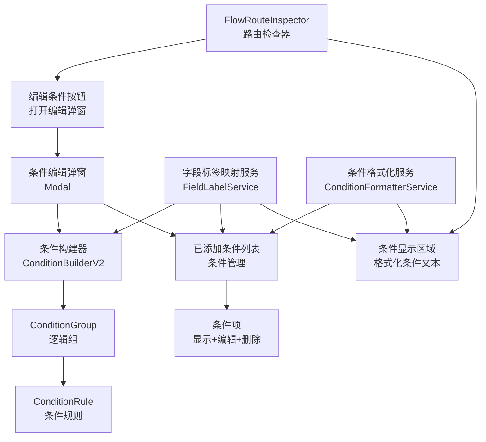

# 设计文档：条件显示本地化和样式优化

## 概述

在审批流程配置中，路由条件的显示和编辑是关键功能。当前系统存在以下问题：

1. **字段显示不友好**：条件中显示英文字段键（如 `student_id`），用户难以理解
2. **条件格式复杂**：JsonLogic 格式对用户不友好，难以快速理解条件规则
3. **编辑弹窗体验差**：弹窗布局不清晰，条件管理功能不完善
4. **操作符显示不统一**：操作符缺少中文标签

本设计通过引入字段标签映射、条件格式化、弹窗样式改进等措施，提升用户体验。

## 架构设计



## 组件和接口

### 1. 字段标签映射服务（FieldLabelService）

**职责**：
- 从表单 Schema 中提取字段标签
- 提供字段键到标签的映射
- 处理标签缺失的情况

**接口定义**：

```typescript
interface FieldLabelService {
  /**
   * 获取字段标签
   * @param fieldKey 字段键
   * @param formSchema 表单 Schema
   * @returns 字段标签，如果不存在则返回字段键
   */
  getFieldLabel(fieldKey: string, formSchema: FormSchema): string

  /**
   * 获取字段标签和键的组合显示
   * @param fieldKey 字段键
   * @param formSchema 表单 Schema
   * @returns 格式为 "标签（键）" 的字符串
   */
  getFieldLabelWithKey(fieldKey: string, formSchema: FormSchema): string

  /**
   * 获取所有字段的标签映射
   * @param formSchema 表单 Schema
   * @returns 字段键到标签的映射对象
   */
  getFieldLabelMap(formSchema: FormSchema): Record<string, string>

  /**
   * 获取字段定义
   * @param fieldKey 字段键
   * @param formSchema 表单 Schema
   * @returns 字段定义对象
   */
  getFieldDefinition(fieldKey: string, formSchema: FormSchema): FieldDefinition | null
}
```

**实现细节**：

```typescript
// 从表单 Schema 中提取字段标签
function getFieldLabel(fieldKey: string, formSchema: FormSchema): string {
  const field = formSchema.fields?.find(f => f.key === fieldKey)
  return field?.name || field?.label || fieldKey
}

// 处理标签缺失的情况
function getFieldLabelWithKey(fieldKey: string, formSchema: FormSchema): string {
  const label = getFieldLabel(fieldKey, formSchema)
  return label === fieldKey ? fieldKey : `${label}（${fieldKey}）`
}
```

### 2. 条件格式化服务（ConditionFormatterService）

**职责**：
- 将 JsonLogic 格式转换为可读的中文文本
- 处理单规则、多规则、嵌套规则等各种情况
- 支持操作符本地化

**接口定义**：

```typescript
interface ConditionFormatterService {
  /**
   * 格式化条件为显示文本
   * @param condition JsonLogic 条件对象
   * @param fieldLabelMap 字段标签映射
   * @returns 格式化后的中文文本
   */
  formatCondition(condition: any, fieldLabelMap: Record<string, string>): string

  /**
   * 格式化单个规则
   * @param rule 规则对象
   * @param fieldLabelMap 字段标签映射
   * @returns 格式化后的中文文本
   */
  formatRule(rule: any, fieldLabelMap: Record<string, string>): string

  /**
   * 获取操作符的中文标签
   * @param operator 操作符
   * @param fieldType 字段类型（可选，用于日期字段的特殊处理）
   * @returns 操作符的中文标签
   */
  getOperatorLabel(operator: string, fieldType?: string): string
}
```

**实现细节**：

条件格式化的核心逻辑：

```typescript
function formatCondition(condition: any, fieldLabelMap: Record<string, string>): string {
  if (!condition) return ''
  
  // 处理 AND 逻辑
  if (condition.and) {
    const parts = condition.and.map(c => formatCondition(c, fieldLabelMap))
    return parts.length === 1 ? parts[0] : `(${parts.join(' 且 ')})`
  }
  
  // 处理 OR 逻辑
  if (condition.or) {
    const parts = condition.or.map(c => formatCondition(c, fieldLabelMap))
    return parts.length === 1 ? parts[0] : `(${parts.join(' 或 ')})`
  }
  
  // 处理单个规则
  return formatRule(condition, fieldLabelMap)
}

function formatRule(rule: any, fieldLabelMap: Record<string, string>): string {
  // 提取字段键、操作符、值
  const [operator, [fieldVar, value]] = Object.entries(rule)[0]
  const fieldKey = fieldVar.var
  const fieldLabel = fieldLabelMap[fieldKey] || fieldKey
  const operatorLabel = getOperatorLabel(operator)
  
  // 格式化值
  const formattedValue = formatValue(value, operator)
  
  return `${fieldLabel} ${operatorLabel} ${formattedValue}`
}
```

### 3. FlowRouteInspector 组件改进

**改进点**：

1. **条件显示区域**：
   - 使用 ConditionFormatterService 格式化条件
   - 显示格式化后的中文文本而不是 JsonLogic
   - 添加"已设置条件"和"未设置条件"的状态指示

2. **编辑条件弹窗**：
   - 改进弹窗标题和说明文字
   - 添加"已添加的条件"列表区域
   - 改进条件构建器的布局
   - 优化操作按钮的排列

**新增 Props**：

```typescript
interface Props {
  route: Route
  formSchema: FormSchema
  disabled?: boolean
}
```

**新增 Emits**：

```typescript
interface Emits {
  (e: 'update:route', value: Route): void
}
```

### 4. 条件编辑弹窗（Condition Modal）

**结构**：

```
┌─────────────────────────────────────────────────────┐
│ 编辑路由条件                                         │
│ 配置表单字段的条件规则，支持多条件组合              │
├─────────────────────────────────────────────────────┤
│                                                     │
│ 已添加的条件 (共 3 个)                              │
│ ┌─────────────────────────────────────────────────┐ │
│ │ 学号 等于 1                    [编辑] [删除]    │ │
│ ├─────────────────────────────────────────────────┤ │
│ │ 报销金额 大于 100              [编辑] [删除]    │ │
│ ├─────────────────────────────────────────────────┤ │
│ │ (费用类别 等于 差旅) 或 (费用类别 等于 会议)   │ │
│ │                                [编辑] [删除]    │ │
│ └─────────────────────────────────────────────────┘ │
│                                                     │
│ 添加新条件                                          │
│ ┌─────────────────────────────────────────────────┐ │
│ │ [条件构建器 ConditionBuilderV2]                 │ │
│ └─────────────────────────────────────────────────┘ │
│                                                     │
├─────────────────────────────────────────────────────┤
│ [取消]                              [保存所有条件]  │
└─────────────────────────────────────────────────────┘
```

**功能**：

1. **已添加的条件列表**：
   - 显示所有已配置的条件
   - 每个条件显示格式化后的中文文本
   - 提供"编辑"和"删除"按钮
   - 显示条件总数

2. **条件构建器区域**：
   - 用于添加新条件或编辑现有条件
   - 使用不同的背景色与列表区分
   - 支持复杂的嵌套逻辑

3. **操作按钮**：
   - "取消"：放弃所有未保存的修改
   - "保存所有条件"：保存所有条件到路由配置

### 5. 操作符本地化

**操作符映射表**：

已在 `condition.ts` 中定义的 `OPERATOR_LABEL_MAP` 和 `DATE_OPERATOR_LABEL_MAP`：

```typescript
export const OPERATOR_LABEL_MAP: Record<Operator, string> = {
  'EQUALS': '等于',
  'NOT_EQUALS': '不等于',
  'GREATER_THAN': '大于',
  'GREATER_EQUAL': '大于等于',
  'LESS_THAN': '小于',
  'LESS_EQUAL': '小于等于',
  'BETWEEN': '介于',
  'CONTAINS': '包含',
  'NOT_CONTAINS': '不包含',
  'IN': '属于',
  'NOT_IN': '不属于',
  'HAS_ANY': '包含任一',
  'HAS_ALL': '包含全部',
  'IS_EMPTY': '为空',
  'IS_NOT_EMPTY': '不为空',
  'DATE_BEFORE_NOW': '早于当前时间',
  'DATE_AFTER_NOW': '晚于当前时间',
}
```

## 数据流

### 1. 条件显示流程

```
路由配置（包含 JsonLogic 条件）
    ↓
FieldLabelService.getFieldLabelMap()
    ↓ 获取字段标签映射
ConditionFormatterService.formatCondition()
    ↓ 格式化条件
显示格式化后的中文文本
```

### 2. 条件编辑流程

```
用户点击"编辑条件"
    ↓
打开条件编辑弹窗
    ↓
加载已有条件到列表
    ↓
用户编辑条件（添加/修改/删除）
    ↓
用户点击"保存所有条件"
    ↓
将条件转换为 JsonLogic 格式
    ↓
更新路由配置
```

### 3. 字段标签获取流程

```
表单 Schema（包含字段定义）
    ↓
FieldLabelService.getFieldLabel(fieldKey)
    ↓ 查找字段定义
返回字段标签（如果不存在则返回字段键）
```

## 文件结构

```
my-app/src/
├── services/
│   ├── fieldLabelService.ts          # 字段标签映射服务
│   └── conditionFormatterService.ts  # 条件格式化服务
├── components/flow-configurator/
│   ├── FlowRouteInspector.vue        # 改进的路由检查器
│   ├── ConditionEditModal.vue        # 新增：条件编辑弹窗
│   └── ConditionListItem.vue         # 新增：条件列表项
└── types/
    └── condition.ts                  # 已有的条件类型定义
```

## 关键实现细节

### 1. 字段标签映射

从表单 Schema 中提取字段标签的逻辑：

```typescript
// 表单 Schema 结构
interface FormSchema {
  version?: string
  fields?: Array<{
    key: string
    name?: string
    label?: string
    type: string
    // ... 其他字段
  }>
  fieldOrder?: string[]
}

// 获取字段标签
function getFieldLabel(fieldKey: string, formSchema: FormSchema): string {
  const field = formSchema.fields?.find(f => f.key === fieldKey)
  if (!field) return fieldKey
  
  // 优先使用 name，其次使用 label，最后使用 key
  return field.name || field.label || fieldKey
}
```

### 2. 条件格式化

处理各种 JsonLogic 格式的条件：

```typescript
// 单规则条件
{ "==": [{ "var": "student_id" }, 1] }
→ "学号 等于 1"

// 多规则 AND 条件
{ "and": [
    { "==": [{ "var": "student_id" }, 1] },
    { ">": [{ "var": "amount" }, 100] }
  ]
}
→ "学号 等于 1 且 报销金额 大于 100"

// 多规则 OR 条件
{ "or": [
    { "==": [{ "var": "student_id" }, 1] },
    { "==": [{ "var": "category" }, "travel"] }
  ]
}
→ "学号 等于 1 或 费用类别 等于 差旅"

// 嵌套条件
{ "or": [
    { "and": [
        { "==": [{ "var": "student_id" }, 1] },
        { ">": [{ "var": "amount" }, 100] }
      ]
    },
    { "==": [{ "var": "category" }, "travel"] }
  ]
}
→ "(学号 等于 1 且 报销金额 大于 100) 或 费用类别 等于 差旅"
```

### 3. 条件编辑弹窗的状态管理

```typescript
interface ConditionEditModalState {
  // 已添加的条件列表
  conditionsList: any[]
  
  // 当前编辑的条件（在条件构建器中）
  editingCondition: ConditionNode | null
  
  // 当前编辑的条件索引（-1 表示添加新条件）
  editingIndex: number
  
  // 弹窗是否显示
  showModal: boolean
}
```

## 样式设计

### 1. 条件显示区域

```css
.condition-details {
  background-color: #f5f7fa;
  border: 1px solid #e0e6ed;
  border-radius: 4px;
  padding: 12px;
  margin: 8px 0;
  font-size: 14px;
  line-height: 1.6;
  color: #333;
}

.condition-placeholder {
  background-color: #f5f7fa;
  border: 1px dashed #d0d7e0;
  border-radius: 4px;
  padding: 12px;
  margin: 8px 0;
  text-align: center;
}
```

### 2. 条件编辑弹窗

```css
.condition-modal-content {
  display: flex;
  flex-direction: column;
  gap: 16px;
}

.conditions-list-section {
  background-color: #f5f7fa;
  border: 1px solid #e0e6ed;
  border-radius: 4px;
  padding: 12px;
}

.list-header {
  display: flex;
  justify-content: space-between;
  align-items: center;
  margin-bottom: 12px;
  font-weight: 500;
}

.conditions-list {
  display: flex;
  flex-direction: column;
  gap: 8px;
  max-height: 300px;
  overflow-y: auto;
}

.condition-item {
  display: flex;
  justify-content: space-between;
  align-items: center;
  background-color: white;
  border: 1px solid #e0e6ed;
  border-radius: 4px;
  padding: 12px;
  font-size: 14px;
}

.condition-actions {
  display: flex;
  gap: 8px;
}
```

### 3. 条件构建器区域

```css
.condition-builder-section {
  background-color: white;
  border: 1px solid #e0e6ed;
  border-radius: 4px;
  padding: 16px;
}

.builder-title {
  font-weight: 500;
  margin-bottom: 12px;
  color: #333;
}
```

## 错误处理

### 1. 字段标签缺失

当字段标签不存在时，使用字段键作为备选：

```typescript
function getFieldLabel(fieldKey: string, formSchema: FormSchema): string {
  const field = formSchema.fields?.find(f => f.key === fieldKey)
  if (!field || !field.name && !field.label) {
    return fieldKey
  }
  return field.name || field.label || fieldKey
}
```

### 2. 无效的字段引用

当条件中引用的字段不存在时，显示字段键：

```typescript
function formatRule(rule: any, fieldLabelMap: Record<string, string>): string {
  const fieldKey = extractFieldKey(rule)
  const fieldLabel = fieldLabelMap[fieldKey] || fieldKey
  // ... 继续格式化
}
```

### 3. 无效的操作符

当操作符不在映射表中时，显示原始操作符：

```typescript
function getOperatorLabel(operator: string, fieldType?: string): string {
  if (fieldType === 'DATE' || fieldType === 'DATETIME') {
    return DATE_OPERATOR_LABEL_MAP[operator] || OPERATOR_LABEL_MAP[operator] || operator
  }
  return OPERATOR_LABEL_MAP[operator] || operator
}
```

## 测试策略

### 单元测试

1. **字段标签映射服务**：
   - 测试字段标签的正确获取
   - 测试标签缺失时的备选处理
   - 测试多字段的标签映射

2. **条件格式化服务**：
   - 测试单规则条件的格式化
   - 测试多规则条件的格式化
   - 测试嵌套条件的格式化
   - 测试操作符的本地化

3. **FlowRouteInspector 组件**：
   - 测试条件显示的正确性
   - 测试编辑条件弹窗的打开和关闭
   - 测试条件的保存和清空

### 集成测试

1. **条件编辑流程**：
   - 测试从路由配置到条件编辑弹窗的数据流
   - 测试条件的添加、编辑、删除
   - 测试条件的保存和加载

2. **字段标签显示**：
   - 测试条件显示中的字段标签正确性
   - 测试条件编辑弹窗中的字段标签正确性
   - 测试条件构建器中的字段标签正确性

### 属性测试

见下一节"正确性属性"。

## 正确性属性

*属性是一个特征或行为，应该在系统的所有有效执行中保持真实。属性充当人类可读规范和机器可验证正确性保证之间的桥梁。*

### Property 1: 字段标签映射的完整性

*对于任何表单 Schema 和任何字段键，如果字段存在于 Schema 中，则 getFieldLabel 应返回字段的标签或名称；如果字段不存在，则应返回字段键本身。*

**验证需求 1.1, 1.2, 1.4, 1.5**

### Property 2: 条件格式化的一致性

*对于任何 JsonLogic 条件和字段标签映射，formatCondition 应返回一个包含所有字段标签（而不是字段键）和所有操作符的中文标签的字符串。*

**验证需求 2.1, 2.2, 2.3, 2.4, 2.5**

### Property 3: 操作符本地化的完整性

*对于任何操作符，getOperatorLabel 应返回该操作符的中文标签；如果操作符不在映射表中，应返回原始操作符。*

**验证需求 5.1, 5.2, 5.3, 5.4**

### Property 4: 条件列表的准确性

*对于任何条件列表，列表中显示的条件数应等于实际的条件数，每个条件的格式化文本应与其对应的 JsonLogic 条件一致。*

**验证需求 3.2, 3.4, 4.1**

### Property 5: 条件编辑的原子性

*对于任何条件编辑操作（添加、修改、删除），编辑后的条件列表应正确反映所有的修改，且不应丢失其他条件。*

**验证需求 4.2, 4.3, 4.4, 4.5**

### Property 6: 字段标签显示格式的一致性

*对于任何字段，在条件构建器的字段选择下拉列表中显示的格式应为"标签（键）"，其中标签是字段的中文名称，键是字段的英文标识符。*

**验证需求 1.3**

## 向后兼容性

1. **现有条件的兼容性**：
   - 新的格式化服务不会修改已保存的 JsonLogic 条件
   - 现有条件可以继续正常加载和显示

2. **字段删除的处理**：
   - 当表单字段被删除时，条件中的字段引用仍然有效
   - 系统会显示字段键而不是标签

3. **操作符的兼容性**：
   - 新的操作符映射不会影响现有的 JsonLogic 格式
   - 未知的操作符会显示原始值

## 性能考虑

1. **字段标签缓存**：
   - 在组件挂载时缓存字段标签映射
   - 避免重复查询表单 Schema

2. **条件格式化缓存**：
   - 对于相同的条件和字段标签映射，缓存格式化结果
   - 使用 computed 或 memo 来优化性能

3. **虚拟滚动**：
   - 当条件列表超过 10 个时，考虑使用虚拟滚动
   - 提高大列表的渲染性能

## 安全考虑

1. **XSS 防护**：
   - 格式化后的文本应该进行 HTML 转义
   - 避免在模板中使用 v-html

2. **输入验证**：
   - 验证字段键的有效性
   - 验证操作符的有效性

3. **权限控制**：
   - 只有有权限的用户才能编辑条件
   - 条件的修改应该记录在审计日志中
