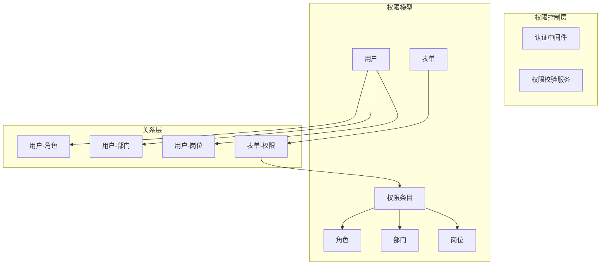

# 设计文档：表单权限系统
## Overview

表单权限系统是一个高校多租户表单平台的权限管理模块，支持基于用户、角色、部门、岗位的多维度权限控制。系统通过中间表实现用户与部门的多对多关系，支持部门层级的权限继承，并提供批量授权功能。

## Architecture



## Data Models

### 1. 用户-部门中间表 (user_department)

```python
class UserDepartment(Base):
    """用户-部门多对多关联表"""
    __tablename__ = "user_department"
    
    user_id: Mapped[int] = mapped_column(ForeignKey("users.id"), primary_key=True)
    department_id: Mapped[int] = mapped_column(ForeignKey("departments.id"), primary_key=True)
    is_primary: Mapped[bool] = mapped_column(default=False, comment="是否主部门")
    created_at: Mapped[datetime] = mapped_column(default_factory=datetime.utcnow)
```

### 2. FormPermission 扩展

```python
class FormPermission(Base):
    """表单权限条目"""
    __tablename__ = "form_permissions"
    
    id: Mapped[int] = mapped_column(primary_key=True, autoincrement=True)
    form_id: Mapped[int] = mapped_column(ForeignKey("forms.id"), nullable=False)
    
    # 权限类型: user/role/department/post
    permission_type: Mapped[str] = mapped_column(String(20), nullable=False)
    target_id: Mapped[int] = mapped_column(nullable=False, comment="角色/部门/岗位ID")
    
    # 权限级别: view/edit/delete/manage
    permission_level: Mapped[str] = mapped_column(String(20), nullable=False)
    
    # 部门层级继承
    include_children: Mapped[bool] = mapped_column(default=False, comment="是否包含子部门")
    
    created_by: Mapped[int] = mapped_column(ForeignKey("users.id"))
    created_at: Mapped[datetime] = mapped_column(default_factory=datetime.utcnow)
```

### 3. 权限级别枚举

```python
class PermissionLevel(Enum):
    VIEW = "view"      # 查看
    EDIT = "edit"      # 编辑
    DELETE = "delete"  # 删除
    MANAGE = "manage"  # 管理
```

## Components and Interfaces

### 权限校验服务 (PermissionService)

```python
class PermissionService:
    """表单权限校验服务"""
    
    async def check_permission(
        self,
        user_id: int,
        form_id: int,
        required_level: PermissionLevel
    ) -> bool:
        """
        校验用户对表单的权限
        
        Preconditions:
        - user_id 对应用户存在且已激活
        - form_id 对应表单存在
        - required_level 为有效的 PermissionLevel 枚举值
        
        Postconditions:
        - 返回 True 当且仅当用户拥有所需权限级别
        - 包含创建者自动拥有 manage 权限的判断
        - 包含部门层级继承的判断
        """
    
    async def get_user_forms(
        self,
        user_id: int,
        level: PermissionLevel = None
    ) -> List[Form]:
        """
        获取用户有权限的表单列表
        
        Preconditions:
        - user_id 对应用户存在
        
        Postconditions:
        - 返回用户拥有权限的所有表单
        - 如果指定 level，则返回至少该权限级别的表单
        """
    
    async def grant_permission(
        self,
        form_id: int,
        permission_type: str,
        target_id: int,
        level: PermissionLevel,
        include_children: bool = False,
        operator_id: int
    ) -> FormPermission:
        """
        授予权限
        
        Preconditions:
        - operator_id 对应用户有 manage 权限
        - 权限参数有效
        
        Postconditions:
        - 创建新的权限记录并返回
        - 相同的 (form_id, permission_type, target_id) 记录唯一
        """
    
    async def batch_grant_permissions(
        self,
        form_id: int,
        permissions: List[GrantPermissionDTO],
        operator_id: int
    ) -> List[FormPermission]:
        """
        批量授予权限
        
        Preconditions:
        - operator_id 对应用户有 manage 权限
        - permissions 列表非空
        
        Postconditions:
        - 批量创建权限记录
        - 全部成功或全部回滚
        """
    
    async def revoke_permission(
        self,
        permission_id: int,
        operator_id: int
    ) -> bool:
        """
        撤销权限
        
        Preconditions:
        - permission_id 对应权限记录存在
        - operator_id 对应用户有 manage 权限
        
        Postconditions:
        - 删除权限记录并返回 True
        - 如果记录不存在返回 False
        """
```

### 部门层级服务 (DepartmentHierarchyService)

```python
class DepartmentHierarchyService:
    """部门层级服务"""
    
    async def get_child_department_ids(
        self,
        department_id: int,
        include_self: bool = True
    ) -> List[int]:
        """
        获取部门及所有子部门ID
        
        Preconditions:
        - department_id 对应部门存在
        
        Postconditions:
        - 返回包含自身的部门ID列表（如果 include_children=True）
        - 使用递归 CTE 或递归查询
        """
    
    async def get_user_all_department_ids(
        self,
        user_id: int
    ) -> List[int]:
        """
        获取用户所属的所有部门ID（包含主部门和子部门）
        
        Preconditions:
        - user_id 对应用户存在
        
        Postconditions:
        - 返回用户关联的所有部门及其子部门ID
        """
```

## Algorithmic Pseudocode

### 权限校验算法

```pascal
ALGORITHM checkPermission
INPUT: user_id, form_id, required_level
OUTPUT: has_permission (boolean)

BEGIN
  // Step 1: 检查表单创建者（自动拥有 manage 权限）
  form ← database.forms.findById(form_id)
  IF form.creator_id = user_id THEN
    IF required_level = MANAGE THEN
      RETURN true
    END IF
    // manage 权限包含 view/edit/delete
    RETURN true
  END IF
  
  // Step 2: 获取用户所有关联的部门ID（包含子部门）
  user_depts ← database.user_departments.findByUserId(user_id)
  dept_ids ← []
  FOR each ud IN user_depts DO
    child_depts ← getChildDepartmentIds(ud.department_id)
    dept_ids.addAll(child_depts)
  END FOR
  
  // Step 3: 获取用户角色ID列表
  user_roles ← database.user_roles.findByUserId(user_id)
  role_ids ← user_roles.map(ur → ur.role_id)
  
  // Step 4: 获取用户岗位ID列表
  user_posts ← database.user_posts.findByUserId(user_id)
  post_ids ← user_posts.map(up → up.post_id)
  
  // Step 5: 查询权限记录
  // 5.1 用户直接授权
  perm ← database.form_permissions.findOne(
    form_id = form_id,
    permission_type = 'user',
    target_id = user_id
  )
  IF perm ≠ null AND perm.level ≥ required_level THEN
    RETURN true
  END IF
  
  // 5.2 角色授权
  perm ← database.form_permissions.findOne(
    form_id = form_id,
    permission_type = 'role',
    target_id IN role_ids
  )
  IF perm ≠ null AND perm.level ≥ required_level THEN
    RETURN true
  END IF
  
  // 5.3 部门授权（包含子部门）
  perm ← database.form_permissions.findOne(
    form_id = form_id,
    permission_type = 'department',
    target_id IN dept_ids,
    include_children = true
  )
  IF perm ≠ null AND perm.level ≥ required_level THEN
    RETURN true
  END IF
  
  // 5.4 岗位授权
  perm ← database.form_permissions.findOne(
    form_id = form_id,
    permission_type = 'post',
    target_id IN post_ids
  )
  IF perm ≠ null AND perm.level ≥ required_level THEN
    RETURN true
  END IF
  
  RETURN false
END
```

### 权限级别比较算法

```pascal
ALGORITHM comparePermissionLevel
INPUT: level1, level2 (PermissionLevel)
OUTPUT: comparison_result (-1, 0, 1)

BEGIN
  level_order ← [VIEW, EDIT, DELETE, MANAGE]
  idx1 ← level_order.indexOf(level1)
  idx2 ← level_order.indexOf(level2)
  
  IF idx1 < idx2 THEN RETURN -1
  IF idx1 > idx2 THEN RETURN 1
  RETURN 0
END
```

## API Endpoints

### 权限管理接口

| 方法 | 路径 | 说明 |
|------|------|------|
| POST | /api/v1/forms/{form_id}/permissions | 授予权限 |
| GET | /api/v1/forms/{form_id}/permissions | 获取权限列表 |
| DELETE | /api/v1/forms/{form_id}/permissions/{perm_id} | 撤销权限 |
| POST | /api/v1/forms/{form_id}/permissions/batch | 批量授权 |
| GET | /api/v1/forms/{form_id}/permissions/check | 检查权限 |

### 下拉选择器数据接口

| 方法 | 路径 | 说明 |
|------|------|------|
| GET | /api/v1/forms/{form_id}/permissions/options/users | 用户列表 |
| GET | /api/v1/forms/{form_id}/permissions/options/roles | 角色列表 |
| GET | /api/v1/forms/{form_id}/permissions/options/departments | 部门列表 |
| GET | /api/v1/forms/{form_id}/permissions/options/posts | 岗位列表 |

### 请求/响应 DTO

```python
class GrantPermissionDTO(BaseModel):
    """授予权限请求"""
    permission_type: str  # user/role/department/post
    target_id: int
    permission_level: str  # view/edit/delete/manage
    include_children: bool = False

class BatchGrantPermissionDTO(BaseModel):
    """批量授权请求"""
    permissions: List[GrantPermissionDTO]

class PermissionResponse(BaseModel):
    """权限响应"""
    id: int
    form_id: int
    permission_type: str
    target_id: int
    target_name: str  # 关联对象名称
    permission_level: str
    include_children: bool
    created_by: int
    created_at: datetime

class PermissionCheckDTO(BaseModel):
    """权限检查请求"""
    required_level: str  # view/edit/delete/manage

class PermissionCheckResponse(BaseModel):
    """权限检查响应"""
    has_permission: bool
    user_level: Optional[str]  # 用户拥有的权限级别
```

## Error Handling

| 错误场景 | HTTP 状态码 | 错误码 | 处理方式 |
|---------|------------|--------|---------|
| 无权限操作 | 403 | PERMISSION_DENIED | 返回 403，提示权限不足 |
| 权限记录不存在 | 404 | PERMISSION_NOT_FOUND | 返回 404 |
| 批量授权部分失败 | 400 | BATCH_PARTIAL_FAIL | 返回失败详情 |
| 部门/角色不存在 | 400 | TARGET_NOT_FOUND | 返回 400，提示目标不存在 |
| 重复授权 | 400 | DUPLICATE_PERMISSION | 返回 400，提示已存在 |

## Testing Strategy

### 单元测试

- 权限校验逻辑覆盖所有权限类型组合
- 部门层级继承测试
- 权限级别比较测试
- 批量授权事务测试

### 集成测试

- 完整权限校验流程测试
- 多租户隔离测试
- API 端点测试

### Property-Based Testing

```python
# 使用 fast-check
forAll(user_id, form_id, required_level)(
    check_permission(user_id, form_id, required_level) == 
    expected_result(user_id, form_id, required_level)
)
```

## Database Migration

```python
"""迁移脚本: 添加表单权限系统相关表

Revision ID: xxx
Revises: yyy
Create Date: 2024-01-01
"""

from alembic import op
import sqlalchemy as sa

def upgrade():
    # 1. 创建用户-部门中间表
    op.create_table(
        'user_department',
        sa.Column('user_id', sa.Integer(), nullable=False),
        sa.Column('department_id', sa.Integer(), nullable=False),
        sa.Column('is_primary', sa.Boolean(), default=False),
        sa.Column('created_at', sa.DateTime(), default=func.now()),
        sa.ForeignKeyConstraint(['user_id'], ['users.id'], ),
        sa.ForeignKeyConstraint(['department_id'], ['departments.id'], ),
        sa.PrimaryKeyConstraint('user_id', 'department_id')
    )
    
    # 2. 添加 include_children 字段到 form_permissions
    op.add_column('form_permissions', 
        sa.Column('include_children', sa.Boolean(), default=False))
    
    # 3. 创建索引
    op.create_index('ix_form_permissions_form_type_target', 
        'form_permissions', ['form_id', 'permission_type', 'target_id'])

def downgrade():
    op.drop_index('ix_form_permissions_form_type_target', table_name='form_permissions')
    op.drop_column('form_permissions', 'include_children')
    op.drop_table('user_department')
```

## Dependencies

- **后端**: SQLAlchemy, Alembic, FastAPI
- **前端**: Naive UI, Axios
- **数据库**: PostgreSQL (支持递归 CTE)
## Dependencies

- **后端**: SQLAlchemy, Alembic, FastAPI
- **前端**: Naive UI, Axios
- **数据库**: PostgreSQL (支持递归 CTE)