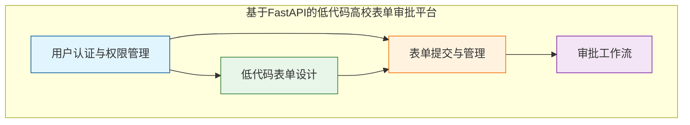
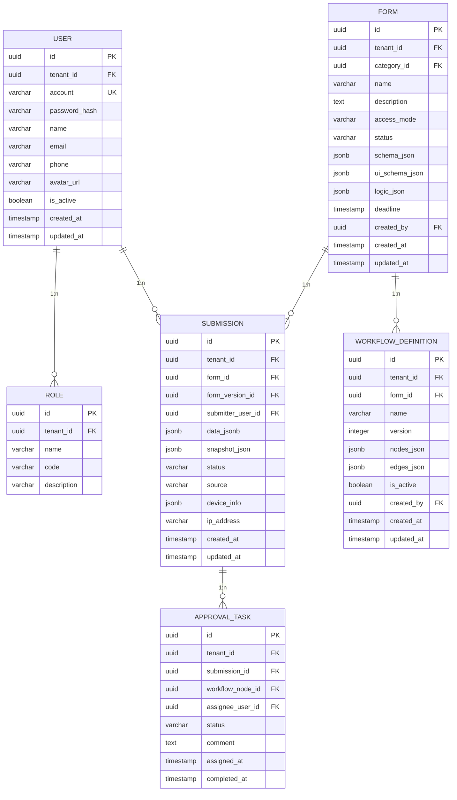

# 第4章 Mermaid图表代码

## 图2：系统总体功能模块图

```mermaid
flowchart TD
    subgraph 标题["基于FastAPI的低代码高校表单审批平台"]
        A["用户认证与权限管理"] --> B["低代码表单设计"]
        A --> C["表单提交与管理"]
        B --> C
        C --> D["审批工作流"]
    end

    style A fill:#e1f5fe,stroke:#01579b
    style B fill:#e8f5e9,stroke:#2e7d32
    style C fill:#fff3e0,stroke:#ef6c00
    style D fill:#f3e5f5,stroke:#7b1faa
```

---

## 图3：系统总体E-R图

```mermaid
erDiagram
    USER ||--o{ ROLE : "1:n"
    USER ||--o{ SUBMISSION : "1:n"
    FORM ||--o{ SUBMISSION : "1:n"
    FORM ||--o{ WORKFLOW_DEFINITION : "1:n"
    SUBMISSION ||--o{ APPROVAL_TASK : "1:n"

    USER {
        uuid id PK
        uuid tenant_id FK
        varchar account UK
        varchar password_hash
        varchar name
        varchar email
        varchar phone
        varchar avatar_url
        boolean is_active
        timestamp created_at
        timestamp updated_at
    }

    ROLE {
        uuid id PK
        uuid tenant_id FK
        varchar name
        varchar code
        varchar description
    }

    FORM {
        uuid id PK
        uuid tenant_id FK
        uuid category_id FK
        varchar name
        text description
        varchar access_mode
        varchar status
        jsonb schema_json
        jsonb ui_schema_json
        jsonb logic_json
        timestamp deadline
        uuid created_by FK
        timestamp created_at
        timestamp updated_at
    }

    SUBMISSION {
        uuid id PK
        uuid tenant_id FK
        uuid form_id FK
        uuid form_version_id FK
        uuid submitter_user_id FK
        jsonb data_jsonb
        jsonb snapshot_json
        varchar status
        varchar source
        jsonb device_info
        varchar ip_address
        timestamp created_at
        timestamp updated_at
    }

    WORKFLOW_DEFINITION {
        uuid id PK
        uuid tenant_id FK
        uuid form_id FK
        varchar name
        integer version
        jsonb nodes_json
        jsonb edges_json
        boolean is_active
        uuid created_by FK
        timestamp created_at
        timestamp updated_at
    }

    APPROVAL_TASK {
        uuid id PK
        uuid tenant_id FK
        uuid submission_id FK
        uuid workflow_node_id FK
        uuid assignee_user_id FK
        varchar status
        text comment
        timestamp assigned_at
        timestamp completed_at
    }
```

---

## 使用方法

1. 访问 https://mermaid.ai/
2. 将上方代码复制到左侧编辑区
3. 右侧会自动生成图表
4. 点击下载按钮导出PNG图片